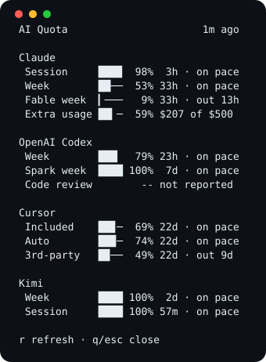

# AI Quota for Herdr

[](https://github.com/kvkenyon/herdr-quota/actions/workflows/ci.yml)
[](LICENSE)

A slim, full-height quota sidebar for Herdr. It keeps the current tab and split arrangement intact, adds a narrow column on the right, and restores the prior layout when closed.



Each provider is deliberately limited to the facts needed for a two-second scan: health, effective remaining percentage, reset countdown, and whether the current pace lasts.

## Install and bind `prefix+u`

Requirements: Herdr 0.7.3 or newer, Node.js 22.19 or newer, npm, and at least one supported provider's official app or CLI signed in locally.

1. Install the plugin:

   ```bash
   herdr plugin install kvkenyon/herdr-quota
   ```

2. Add this command binding to `~/.config/herdr/config.toml`:

   ```toml
   [[keys.command]]
   key = "prefix+u"
   type = "plugin_action"
   command = "herdr-quota.open-dashboard"
   description = "AI quota"
   ```

3. Load the new binding into the running Herdr server:

   ```bash
   herdr server reload-config
   ```

Now press your configured prefix (for example `ctrl+b`) followed by `u`. The first press opens and focuses the right sidebar; the next press toggles it closed.

Herdr currently reads custom command bindings only from `config.toml`; plugin manifests cannot install them. The exact old failure was subtle: Herdr's plugin schema has actions and panes but no keybinding collection, while its TOML parser tolerates unknown top-level tables. A manifest `[[keys.command]]` therefore parsed but was silently absent from `herdr plugin list` and never registered an action log when pressed. The plugin now omits that false declaration and never rewrites your configuration during installation.

If the key does not respond, invoke the same action directly to distinguish a binding problem from a plugin problem:

```bash
herdr plugin action invoke herdr-quota.open-dashboard
```

Then run `herdr config check` and repeat `herdr server reload-config` after correcting any reported configuration issue.

To update, run the install command again. To remove the plugin:

```bash
herdr plugin uninstall herdr-quota
```

Remove the `[[keys.command]]` block from `config.toml` and reload configuration when you no longer want the binding.

## Use

| Control      | Action                                         |
| ------------ | ---------------------------------------------- |
| `prefix+u`   | Toggle the quota sidebar                       |
| `r`          | Refresh while keeping the last reading visible |
| `q` / Escape | Close and restore the prior layout             |

The sidebar targets 36 terminal cells on ordinary wide screens and scales down when the tab is narrow. The normal Claude, OpenAI Codex, Cursor, and Kimi set fits at ordinary terminal height without scrolling. Tiny color accents help recognition, but provider names and health text remain authoritative. Unknown readings stay unknown rather than becoming a misleading zero.

The default view intentionally omits plans, sources, credits, confidence prose, complete window lists, and bounding details. Those fields remain in the normalized in-memory model so effective headroom and the limiting reset continue to be calculated truthfully.

## Data and privacy

The plugin delegates provider access to its plugin-local `quota-axi@~0.1.29` executable and consumes schema version 5 from `quota-axi --json --full`. It does not duplicate provider authentication, inspect browser databases itself, or implement vendor refresh-token flows.

- Credentials remain in stores owned by official provider tools.
- Provider requests go directly from `quota-axi` to first-party endpoints.
- The normalized response remains in dashboard memory and is not persisted.
- Raw responses, account identifiers, credentials, and credential paths are never logged.
- Refreshes have a 12-second process deadline and 2 MiB output limit.
- Child-process and provider errors are bounded and sanitized; one failed provider does not hide the others.

See [Data sources and maintenance](docs/data-sources.md) for the provider boundary and known uncertainties.

### macOS Keychain approval

Claude Code and Cursor may keep live access tokens in the login Keychain. `quota-axi` avoids prompting during an ordinary sidebar refresh. If the sidebar reports that approval is required, run this once in a terminal and choose **Always Allow**:

```bash
npx --yes quota-axi@0.1.29 --allow-keychain-prompt --provider claude,cursor
```

The approval and non-secret access marker belong to `quota-axi`; this plugin never receives or stores the credential.

## Troubleshooting

**The direct action works but `prefix+u` does nothing.** The plugin is installed, but the binding is missing or has not been reloaded. Add the exact config block above, run `herdr config check`, then `herdr server reload-config`.

**A provider says authentication required.** Sign in with that provider's official CLI. On macOS, Claude or Cursor may also need the one-time Keychain approval above.

**A reading is stale or unknown.** The sidebar preserves truthful state when a provider cannot be reached. Press `r` after connectivity or authentication recovers.

**Refresh times out.** The sidebar terminates `quota-axi` after 12 seconds so an unavailable vendor cannot strand the pane. Independent provider results remain visible when available.

**The plugin does not build.** Confirm `node --version` is at least 22.19 and `npm --version` works, then rerun installation. Herdr retains the previous managed install when an update build fails.

## Develop

```bash
npm ci
npm run check
npm run preview
```

`npm run check` formats, lints, type-checks, tests, and regenerates the sanitized preview. The runtime provider boundary lives in `src/schema.ts` and [docs/data-sources.md](docs/data-sources.md); provider credential or endpoint changes belong upstream in `quota-axi`.

## License and references

MIT licensed. See [THIRD_PARTY_NOTICES.md](THIRD_PARTY_NOTICES.md) for the open-source Herdr plugins reviewed during design.
